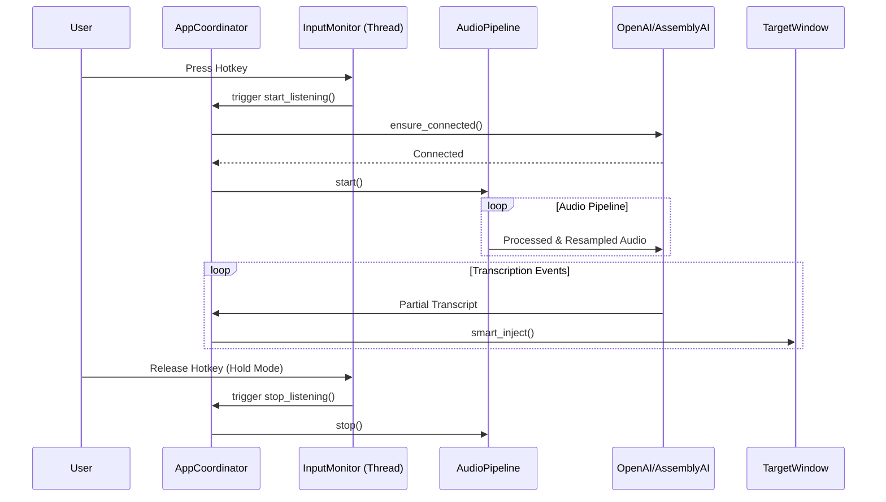

# ParrotInk Architecture Documentation

## 1. High-Level Architecture
ParrotInk follows a **hybrid asynchronous/threaded model** designed to handle real-time I/O without blocking the user interface or audio processing.

### Core Concepts
1.  **The Brain (Asyncio):** The core logic runs on Python's `asyncio` event loop (Main Thread). This handles high-level state management and WebSocket communication.
2.  **The Senses (Threading):** Blocking I/O operations (Microphone, Global Hotkeys, Mouse Hooks) run in dedicated background threads to prevent freezing the application.
3.  **The Face (Threading):** UI elements (System Tray, Floating Indicator) run in their own isolated threads to ensure they remain responsive and don't conflict with the main loop.

### Component Interaction Diagram

```mermaid
graph TD
    User[User Hardware] -->|Audio| SD[AudioStreamer (Thread)]
    User -->|Keys| Hooks[keyboard (Thread)]
    User -->|Mouse| MHooks[pynput (Thread)]
    
    SD -->|Queue| Pipe[AudioPipeline (Async)]
    Hooks -->|ThreadSafe Call| Coord[AppCoordinator (Asyncio)]
    
    Coord -->|WebSocket| Cloud[OpenAI / AssemblyAI]
    Cloud -->|Events| Coord
    
    Coord -->|State| Tray[Tray Icon (Thread)]
    Coord -->|State| Indicator[IndicatorUI (Thread)]
    Coord -->|Sound| Spkr[Speaker (Thread)]
    
    Coord -->|Injection| App[Target Window]
```

---

## 2. File Structure & Responsibilities

### Root Directory
*   **`main.py`**: The entry point and orchestrator.
    *   **`AppCoordinator`**: The central class. Manages state, handles hotkeys, and syncs data between components.
*   **`config.toml`**: User configuration.

### `engine/` Directory (Core Logic)
*   **`audio/`**
    *   **`streamer.py`**: Wraps `sounddevice`. Spawns a C-level thread for audio capture.
    *   **`pipeline.py`**: Orchestrates the flow from streamer through adapter to provider.
    *   **`adapter.py`**: Handles resampling (via `soxr`) and format conversion.
*   **`interaction.py`**
    *   **`InputMonitor`**: Wraps the `keyboard` library. Provides zero-leakage suppression and multi-key debouncing.
*   **`mouse.py`**
    *   **`MouseMonitor`**: Wraps `pynput.mouse`. Listens for clicks to trigger click-away cancellation.
*   **`injector.py`** & **`injection.py`**
    *   **`SmartInjector`**: Calculates text deltas and performs Win32 `SendInput` calls.
*   **`anchor.py`**
    *   **`Anchor`**: Uses `GetGUIThreadInfo` to precisely track the target window/control context.
*   **`config.py`**: Pydantic configuration system with profile resolution.
*   **`security.py`**: Secure API key management via Windows Credential Manager.

### `engine/` (User Interface)
*   **`ui.py`**: `TrayApp` (pystray) system tray interface.
*   **`indicator_ui.py`**: `IndicatorWindow` proxy controller.
*   **`hud_renderer.py`**: High-performance Skia-based Acrylic HUD.
*   **`hud_styles.py`**: Skia drawing logic for the "Glass" visual style.

### `engine/transcription/` Directory (Cloud Integration)
*   **`base.py`**: Abstract base class for providers.
*   **`factory.py`**: Provider instantiation logic.
*   **`openai_provider.py`**: OpenAI Realtime API (WebSocket).
*   **`assemblyai_provider.py`**: AssemblyAI Streaming V3 (WebSocket).

---

## 3. Detailed Data Flow

### A. The "Life" of a Transcription Session

1.  **Trigger (Hotkey Press)**
    *   `keyboard` hook thread detects combo.
    *   Calls `coordinator.start_listening()` via `asyncio.run_coroutine_threadsafe`.

2.  **Initialization**
    *   **Anchor:** `Anchor.capture_current()` saves the ID of the window/control you are typing into.
    *   **Connection:** `ConnectionManager` ensures a "warm" or new connection.
    *   **Feedback:** `_play_feedback_sound("start")`.
    *   **State:** Transition to `LISTENING`.

3.  **The Audio Pipeline**
    *   `AudioStreamer` (Thread) -> `AudioPipeline` (Async) -> `AudioAdapter` (Resample) -> `Provider.send_audio()`.

4.  **The Text Loop (Response)**
    *   WebSocket receives JSON -> `provider._handle_event`.
    *   `AppCoordinator` receives text -> `InjectionController.smart_inject()`.
    *   `SmartInjector` performs backspaces (if needed) and types new text.

5.  **Termination (Hotkey Release / Manual Stop / Click Away)**
    *   Trigger calls `coordinator.stop_listening()`.
    *   **Cleanup:**
        *   `AudioPipeline` stops.
        *   `ConnectionManager` starts idle timer (to keep connection warm) or rotates session.
        *   `InputMonitor` resets debouncing state.
        *   `_play_feedback_sound("stop")`.

### Sequence Diagram


