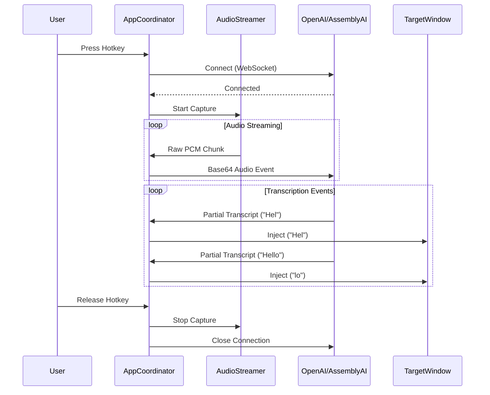

# ParrotInk Architecture Documentation

## 1. High-Level Architecture
ParrotInk follows a **hybrid asynchronous/threaded model** designed to handle real-time I/O without blocking the user interface or audio processing.

### Core Concepts
1.  **The Brain (Asyncio):** The core logic runs on Python's `asyncio` event loop (Main Thread). This handles high-level state management and WebSocket communication.
2.  **The Senses (Threading):** Blocking I/O operations (Microphone, Global Hotkeys, Mouse Hooks) run in dedicated background threads to prevent freezing the application.
3.  **The Face (Threading):** UI elements (System Tray, Floating Indicator) run in their own isolated threads to ensure they remain responsive and don't conflict with the main loop.

### Component Interaction Diagram

```mermaid
graph TD
    User[User Hardware] -->|Audio| SD[AudioStreamer (Thread)]
    User -->|Keys/Mouse| Hooks[pynput (Thread)]
    
    SD -->|Queue| Coord[AppCoordinator (Asyncio Main Loop)]
    Hooks -->|ThreadSafe Call| Coord
    
    Coord -->|WebSocket| Cloud[OpenAI / AssemblyAI]
    Cloud -->|Events| Coord
    
    Coord -->|State Change| Tray[Tray Icon (Thread)]
    Coord -->|State Change| Float[Floating UI (Thread)]
    Coord -->|Sound| Spkr[Speaker (Thread)]
    
    Coord -->|Injection| App[Target Window]
```

---

## 2. File Structure & Responsibilities

### Root Directory
*   **`main.py`**: The entry point and orchestrator.
    *   **`AppCoordinator`**: The central class. Manages state (`is_listening`), handles hotkeys, and syncs data between the AudioStreamer and the Transcription Provider.
    *   **`main_async`**: Sets up the asyncio loop, signals (Ctrl+C), and threads.
*   **`config.toml`**: User configuration (API keys, hotkeys, timeouts).

### `engine/` Directory (Core Logic)
*   **`audio.py`**
    *   **`AudioStreamer`**: Wraps `sounddevice`. Spawns a C-level thread for audio capture. buffers audio in a thread-safe `queue.Queue`.
    *   **`async_generator()`**: A bridge that allows the asyncio loop to "pull" audio chunks from the thread queue without blocking.
*   **`interaction.py`**
    *   **`InteractionMonitor`**: Wraps `pynput.keyboard`. Listens for "Any Key" presses to stop dictation (in Toggle Mode).
*   **`mouse.py`**
    *   **`MouseMonitor`**: Wraps `pynput.mouse`. Listens for clicks to trigger "Click-Away Cancellation".
*   **`injector.py`**
    *   **`inject_text(text)`**: Uses `ctypes` / `SendInput` (Win32 API) to simulate keystrokes into the active window.
    *   **`inject_backspaces(count)`**: Simulates backspace presses for smart text correction.
*   **`anchor.py`**
    *   **`Anchor`**: Captures the active window handle (`HWND`) or control handle when recording starts. Used to determine if the user clicked "outside" the target area.
*   **`config.py`**
    *   **`Config`**: Pydantic models for type-safe configuration loading and validation.
*   **`security.py`**
    *   **`SecurityManager`**: Handles secure API key storage using the OS Keyring (Windows Credential Manager).

### `engine/ui` Directory (User Interface)
*   **`ui.py`**
    *   **`TrayApp`**: Wraps `pystray`. runs the System Tray icon and menu in a dedicated thread.
*   **`indicator_ui.py`**
    *   **`FloatingIndicator`**: Wraps `tkinter`. Renders the floating red/gray dot.
    *   **Critical:** Runs its own `tk.mainloop()` in a separate thread to avoid "Apartment" threading issues on Windows.
*   **`credential_ui.py`**: Simple dialogs for prompting for API keys.
*   **`audio_feedback.py`**: Fires transient threads to play WAV files (`winsound`) for start/stop confirmation.

### `engine/transcription/` Directory (Cloud Integration)
*   **`base.py`**: Abstract base class defining the interface (`start`, `stop`, `send_audio`).
*   **`factory.py`**: Instantiates the correct provider based on config.
*   **`openai_provider.py`**: Handles OpenAI Realtime API (WebSocket).
*   **`assemblyai_provider.py`**: Handles AssemblyAI Streaming V3 (WebSocket).

---

## 3. Detailed Data Flow

### A. The "Life" of a Transcription Session

1.  **Trigger (Hotkey Press)**
    *   `pynput` thread detects key combo.
    *   Calls `coordinator.start_listening()` via `asyncio.run_coroutine_threadsafe`.

2.  **Initialization**
    *   **Anchor:** `Anchor.capture_current()` saves the ID of the window you are typing into.
    *   **Connection:** `TranscriptionFactory` creates a provider (e.g., OpenAI). `provider.start()` opens the WebSocket.
    *   **Feedback:** `_play_feedback_sound("start")` beeps.
    *   **State:** `is_listening = True`. UI turns Red.

3.  **The Audio Loop (`_audio_pipe`)**
    *   `AudioStreamer` (Thread) -> captures mic -> `Queue`.
    *   `AppCoordinator` (Async) -> `async for chunk in streamer` -> pulls from Queue.
    *   `AppCoordinator` -> `provider.send_audio(chunk)`.
    *   `OpenAIProvider` -> Resamples to 24kHz -> Base64 Encode -> WebSocket Send.

4.  **The Text Loop (Response)**
    *   WebSocket receives JSON -> `provider._handle_event`.
    *   **Partial:** `coordinator.on_partial("Hello w")` -> calls `_smart_inject`.
    *   **Smart Inject:**
        *   Compares "Hello w" with previous "Hello".
        *   Determines: Append " w".
        *   Calls `injector.inject_text(" w")`.
    *   **Correction (AssemblyAI):**
        *   New: "Hello world" (Previous: "Hello word").
        *   Diff: Backspace 4, Type "orld".
        *   Calls `injector.inject_backspaces(4)` then `inject_text("orld")`.

5.  **Termination (Hotkey Release / Manual Stop)**
    *   `pynput` thread detects release.
    *   Calls `coordinator.stop_listening()`.
    *   **Cleanup:**
        *   `streamer.stop()` (Mic off).
        *   `provider.stop()` (WebSocket close).
        *   `ui.set_state(IDLE)` (UI turns Gray).
        *   `_play_feedback_sound("stop")`.

### Sequence Diagram


